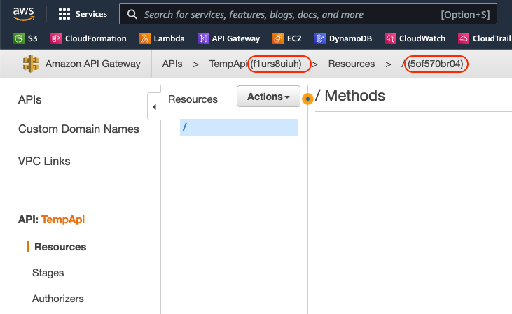

# Myriad
## Cloud Formation Templates

The cloud formation template "cft-myriad-core.yaml" creates all the necessary resources required to run MyriAD in your AWS account.  It assumes you are running the template with a policy that has the permissions to create the resources necessary (listed below).  The policy document can be found in the "policies" directory.

**Minimum Required Permissions**
- apigateway:
    - DELETE
    - GET
    - PATCH
    - POST
    - PUT
- cloudformation:
    - CreateStack
    - CreateStackInstances
    - DeleteStack
    - DeleteStackInstances
    - DescribeChangeSet
    - DescribeStackEvents
    - DescribeStacks
    - GetTemplate
    - GetTemplateSummary
    - ListStackInstances
    - ListStackResources
    - ListStacks
    - ListStackSetOperations
    - UpdateStack
    - UpdateStackInstances
    - ValidateTemplate
- iam:
    - AttachRolePolicy
    - CreatePolicy
    - CreatePolicyVersion
    - CreateRole
    - DeletePolicy
    - DeletePolicyVersion
    - DeleteRole
    - DetachRolePolicy
    - GetPolicy
    - GetRole
    - ListAttachedRolePolicies
    - ListPolicies
    - ListPolicyVersions
    - ListRoles
    - PassRole
    - UpdateRole
- lambda:
    - AddPermission
    - CreateFunction
    - DeleteFunction
    - GetAccountSettings
    - GetFunction
    - GetFunctionConfiguration
    - ListFunctions
    - RemovePermission
    - UpdateFunctionCode
    - UpdateFunctionConfiguration
- s3:
    - GetObject

## Prerequesites For Running Core Template

The core cloud formation template expects a few items to have been created before calling it.  All of the items below can be created by running the cft-myriad-init.yaml template, or can be created from the AWS console.

- **Lambda Execution IAM Role** - This role should have, at a minimum the following policies attached to it :
    - arn:aws:iam::aws:policy/AWSLambdaExecute
    - arn:aws:iam::aws:policy/service-role/AWSLambdaVPCAccessExecutionRole (*only needed if Lambda will be executed inside of a VPC*)
- **REST API (API Gateway)** - The core template requires an existing REST Api where it can create its resources, methods, api keys (optional) and usage plans (optional).  The two bits of information needed about the REST Api are the Gateway Id and the Root Resource Id (pictured below) 
    - APIs > MyApi (**API ID**) > Resources > / (**Root Resource Id**)
    - 
- **EC2 Security Group** - This is only required if the lambda function will be deployed inside of a VPC.  The default security group created by the init template blocks all inbound connections, but allows all outbound connections.  I'm sure this can be restricted further if you feel that is too permissive.

## Template Variables

Below is the list of variables needed to run the core cloud formation template, and a brief explaination of each: 

### Lambda Function Variables
| Variable Name | Required | Description
| ------------- | -------- | -----------
| MyriadCodeBucketName | Yes | The name of the S3 Bucket which contains the Lambda DotNet Core code (the Zephyr.Directory.Aws.zip file)
| MyriadCodeBucketKey | Yes | The key of the S3 Lambda DotNet Core code object (ex: code/Zephyr.Directory.Aws.zip)
| MyriadCoreFunctionName | Yes | The name of the lambda function.
| LambdaCoreRoleArn | Yes | The ARN (Amazon Resource Name) for the iam role to be used by the lambda functions.  See the [prerequisites](#prerequesites-for-running-core-template) for details.
| MyriadVpcSubnetIds | No (1) | A comma separated list of VPC Subnets where the lambda functions should be deployed
| MyriadVpcSecurityGroupIds | No (1) | A comma separated list of security groups to apply to lambda function.

### LDAP Configuration
| Variable Name | Required | Description
| ------------- | -------- | -----------
| MyriadEnvDefaultConfig | No (2) | Json string representing the default configuration to connect to the LDAP server.  Used when connection details are not provided in the request and for queries by object type. (see [Ldap Config](#ldap-config) for example)
| MyriadEnvDomainMapping | No (3) | Json string representing a mapping of full domains and/or short domain names to environment variables that provide connection details to that domain. (see [LDAP Domain Mappings](ldap-domain-mappings)) for example)
| MyriadEnvReturnTypes | No | Json string representing attributes that should be returned as a different type other than string.  (see [Attribute Mapping](#attribute-mapping) for example)

### API Gateway Variables
| Variable Name | Required | Description
| ------------- | -------- | -----------
| ApiGatewayId | Yes | The API Gateway Id where the Resources, Methods, API Keys and Cost Plans will be deployed.
| RootResourceId | Yes | The Root Resource Id for your API Gateway.  Template will create /search and /{type} resources off the main root resource.
| ApiGatewayStageName | Yes | The name of the stage where the API Gateway will be deployed.
| DeployToStage | Yes | Boolean value indicating whether or not the API Gateway should be deployed after creation.
| SecureWithApiKey | Yes | Boolean value indicating whether or not the API Gateway methods should be securied with an API Key.
| ApiDefaultKeyName | No (4) | Name of the default API Key created for MyriAD (Leave Blank If Not Secured With API or you already have an API Key associated with this API Gateway)
| ApiDefaultUsagePlanName | No (4) | Name of the default Usage Plan created for MyriAD (Leave Blank If Not Secured with API or y ou already have a Usage Plan associated with this API Gateway)


- 1 = Only required if lambda function is being deployed into a VPC.  Leave blank otherwise.
- 2 = If a default configuration is not provided, every call to MyriAD must contain connection details inside the search POST request.  Queries by object time will not work.
- 3 = If you are using domain mappings, you will have to manually create lambda environment variables for each ldap server you wish to connect to, in the same format as the [LDAP Config](#ldap-config) used in the default config variable.
- 4 = Leave blank if you don't want the template to create these objects

## JSON Configuration Objects

### LDAP Config
*Saves in DEFAULT_CONFIG environment variable*
```json
{ 
    "server": "my.ldapsever.company.com",
    "ssl" : true,
    "username": "MyUserName",
    "password": "MyEncryptedOrPlainTextPassword"
}
```

### LDAP Domain Mappings
**ALL CAPS ONLY** - *Saves in DOMAIN_MAPPINGS enviornment variable*
```json
{
    "SB1":"DEFAULT_CONFIG",
    "SANDBOX.MYCOMPANY.COM":"DEFAULT_CONFIG",
    "SB2":"SB2_CONFIG",
    "SANDBOX2.MYCOMPANY.COM":"SB2_CONFIG",
    "SB3":"SB3_CONFIG",
    "SANDBOX3.BP.COM":"SB3_CONFIG"
}
```

### Attribute Mapping
*Saves in RETURN_TYPES environment variable.  
Valid values are (String, StringArray, Bytes, BytesArray, Guid or Sid)*
```json
{
    "comment":"Bytes",
    "mS-DS-ConsistencyGuid":"Guid",
    "msExchArchiveGUID":"Guid",
    "msExchMailboxGuid":"Guid",
    "thumbnailPhoto":"Bytes",
    "directReports":"StringArray",
    "showInAddressBook":"StringArray",
    "msRTCSIP-UserPolicies":"BytesArray"
}
```
